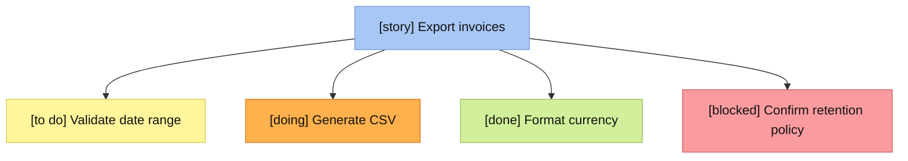

# Discovery Trees

Use a Discovery Tree as a live information radiator for the work being discussed. It is a conversation artifact, not a repository artifact: derive it from the current plan and the work just completed. Its purpose is to expose the smallest useful picture of progress and make the next decision easy.

For the practice’s origin and broader mindset, consult [references/industrial-logic-discovery-trees.md](references/industrial-logic-discovery-trees.md) when the user asks about the rationale, history, or adaptations of Discovery Trees. The rendering and communication workflow in this skill remains the source of truth for agent behavior.

## When to render

Render a fresh tree in the conversation when you:

- propose a new plan or turn a specification into planned work;
- revise a plan because scope, ordering, dependencies, or understanding changed;
- complete a planned task; or
- uncover work that changes the next decision.

Do not wait for a formal planning ceremony. Discovery Trees support just-in-time planning, so add a small branch when new work is learned rather than pretending it was known from the start.

## Choose the decision horizon

Show only the portion of the tree that helps the human decide what to do next:

- the active story;
- the path to current work and its unfinished descendants;
- viable sibling branches that represent a real choice;
- blockers and prerequisites that affect the choice; and
- enough completed work to explain what is already true.

Collapse unrelated or low-value completed detail into a short summary rather than rendering the entire plan. Expand the tree when the current view does not make a tradeoff or dependency understandable.

Keep tasks as small, concrete units of work. Prefer thin, user-observable slices over layers of implementation work. A node may contain a placeholder, question, or newly discovered concern when that helps preserve focus.

## Status vocabulary and visual language

Every node carries one of these statuses. Use the exact color in Mermaid and the matching swatch plus label in a text fallback.

| Status | Meaning | Mermaid fill | Text marker |
| --- | --- | --- | --- |
| `story` | User value or outcome being pursued | `#A9C7F5` | `🟦 [story]` |
| `to do` | Planned, unstarted work | `#FFF59B` | `🟨 [to do]` |
| `doing` | Work actively in progress | `#FFB14D` | `🟧 [doing]` |
| `done` | Completed work | `#D2F09B` | `🟩 [done]` |
| `blocked` | Cannot responsibly proceed without an external answer, decision, or prerequisite | `#FA9C9F` | `🟥 [blocked]` |

Never mark a card blocked merely because it is lower priority.

## Render the tree

Use a Mermaid flowchart when Mermaid is supported in the current conversation. Use `flowchart TD` and a code fence labeled `mermaid`. Give every card its status label, so the structure remains clear if a renderer loses color.



If Mermaid is unavailable, render the same hierarchy in a plain-text code block. Preserve the text marker and status label exactly; color alone is not reliable in all terminals and chat clients.

```text
🟦 [story] Export invoices
├─ 🟨 [to do] Validate date range
├─ 🟧 [doing] Generate CSV
├─ 🟩 [done] Format currency
└─ 🟥 [blocked] Confirm retention policy
```

Use arrows only for parent-child work relationships. State a cross-branch dependency in the node text, for example `[blocked] Publish API — waiting for retention policy`, instead of adding a confusing web of edges.

## Recommend the next task

After every tree, add a concise `Recommended next:` line naming one action and why it is the best move now. Make the recommendation from the visible decision horizon:

- continue the current `doing` work when it is unblocked and remains the shortest route to a meaningful slice;
- otherwise choose an unblocked `to do` task that unlocks a thin, valuable slice or removes the most consequential uncertainty;
- recommend resolving a blocker when no useful unblocked work exists; and
- if multiple choices are genuinely comparable, name the preferred one and briefly mention the tradeoff, leaving the human free to choose another.

Do not manufacture certainty. When the next move depends on product, operational, or architectural judgment the human must make, represent that explicitly as `blocked` and recommend the smallest clarifying conversation.

## Response shape

When a tree is warranted, lead with the visual, then the recommendation. Keep any supporting explanation short and only include it if it changes the decision. On a plan adjustment, call out what changed in one sentence. On completion, update the completed node before showing the next recommendation.
